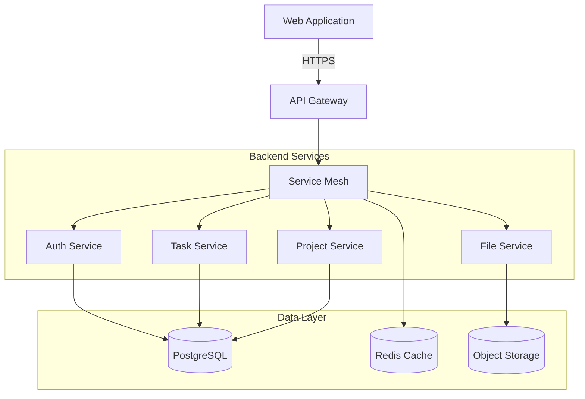

# Task Management System

[](https://github.com/org/repo/actions)
[](https://codecov.io/gh/org/repo)
[](https://snyk.io/test/github/org/repo)
[](LICENSE)

A comprehensive enterprise-grade task management system designed for scalable team collaboration and project organization.

## Overview

The Task Management System is a cloud-based, multi-tier web application built with a microservices architecture that enables efficient task tracking, project management, and team collaboration. The system provides a centralized platform for managing tasks, projects, and team resources with real-time updates and comprehensive reporting capabilities.

### Key Features

- **Task Management**
  - Task creation and assignment
  - Priority and status tracking
  - Due date management
  - File attachments

- **Project Organization**
  - Hierarchical project structure
  - Team management
  - Milestone tracking
  - Resource allocation

- **Collaboration**
  - Real-time updates
  - Comment threads
  - @mentions
  - File sharing

- **Reporting**
  - Custom dashboards
  - Performance analytics
  - Export capabilities

## System Architecture



## Prerequisites

### Development Environment

- Node.js 18.x
- Java 17
- Go 1.21
- Python 3.11+
- Docker 24.0+
- Kubernetes 1.27+

### Tools

- npm 9.x (Frontend package management)
- Maven 3.8+ (Java service build)
- kubectl 1.27+ (Kubernetes management)
- Docker Compose (Local development)

## Getting Started

1. **Clone the Repository**
   ```bash
   git clone https://github.com/org/task-management-system.git
   cd task-management-system
   ```

2. **Environment Setup**
   ```bash
   # Copy environment configuration
   cp .env.example .env
   
   # Install dependencies
   ./scripts/setup.sh
   ```

3. **Local Development**
   ```bash
   # Start development environment
   docker-compose up -d
   
   # Initialize database
   ./scripts/init-db.sh
   
   # Start services
   npm run dev     # Frontend
   ./mvnw spring-boot:run  # Backend services
   ```

4. **Verify Installation**
   ```bash
   # Run health checks
   ./scripts/health-check.sh
   
   # Run test suite
   npm test        # Frontend tests
   ./mvnw test     # Backend tests
   ```

## Development

### Project Structure

```
├── src/
│   ├── backend/          # Backend microservices
│   │   ├── auth/         # Authentication service
│   │   ├── task/         # Task management service
│   │   └── file/         # File handling service
│   └── web/             # React frontend application
├── infrastructure/      # Kubernetes configurations
└── .github/            # GitHub Actions workflows
```

### Development Workflow

1. Create feature branch from `develop`
2. Implement changes following code standards
3. Write tests and documentation
4. Submit pull request for review
5. Merge to `develop` after approval

For detailed guidelines, see [CONTRIBUTING.md](CONTRIBUTING.md).

## Deployment

### Production Requirements

- Kubernetes cluster 1.27+
- PostgreSQL 14+
- Redis 7.0+
- Object storage (S3-compatible)

### Deployment Process

1. **Build and Package**
   ```bash
   # Build services
   ./scripts/build.sh
   
   # Package containers
   docker-compose build
   ```

2. **Deploy to Kubernetes**
   ```bash
   # Apply configurations
   kubectl apply -f infrastructure/
   
   # Verify deployment
   kubectl get pods -n task-system
   ```

3. **Configure Monitoring**
   ```bash
   # Install monitoring stack
   helm install monitoring infrastructure/monitoring
   
   # Configure alerts
   kubectl apply -f infrastructure/alerts/
   ```

## Configuration

### Environment Variables

| Variable | Description | Default |
|----------|-------------|---------|
| `NODE_ENV` | Environment name | `development` |
| `DB_HOST` | Database host | `localhost` |
| `REDIS_URL` | Redis connection URL | `redis://localhost:6379` |
| `JWT_SECRET` | JWT signing secret | Required |
| `S3_BUCKET` | File storage bucket | Required |

### Feature Flags

| Flag | Description | Default |
|------|-------------|---------|
| `ENABLE_NOTIFICATIONS` | Enable notification system | `true` |
| `USE_LEGACY_AUTH` | Use legacy authentication | `false` |
| `ENABLE_ANALYTICS` | Enable usage analytics | `true` |

## Performance

- Page load time: < 2 seconds
- API response time: < 200ms
- Concurrent users: 1000+
- System availability: 99.9%

## Security

- HTTPS-only communication
- JWT-based authentication
- Role-based access control
- Data encryption at rest
- Regular security audits

For security guidelines and vulnerability reporting, see [SECURITY.md](SECURITY.md).

## License

This project is licensed under the MIT License - see the [LICENSE](LICENSE) file for details.

## Support

- Documentation: `/docs`
- Issue Tracker: GitHub Issues
- Slack Channel: #task-management-support

## Contributing

We welcome contributions! Please see [CONTRIBUTING.md](CONTRIBUTING.md) for guidelines.

## Acknowledgments

- React Team
- Spring Framework
- Kubernetes Community
- Open Source Contributors