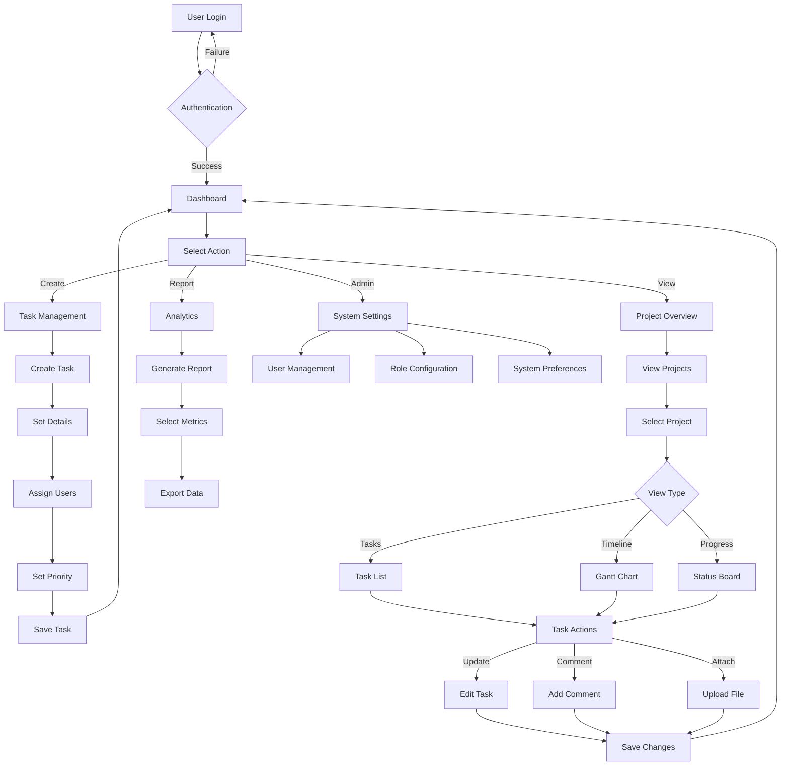
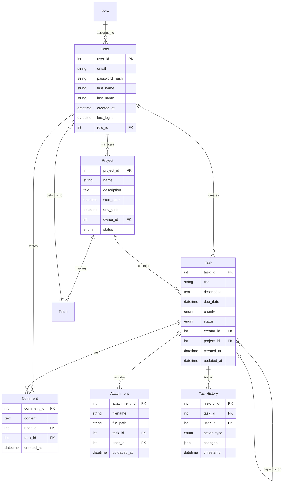
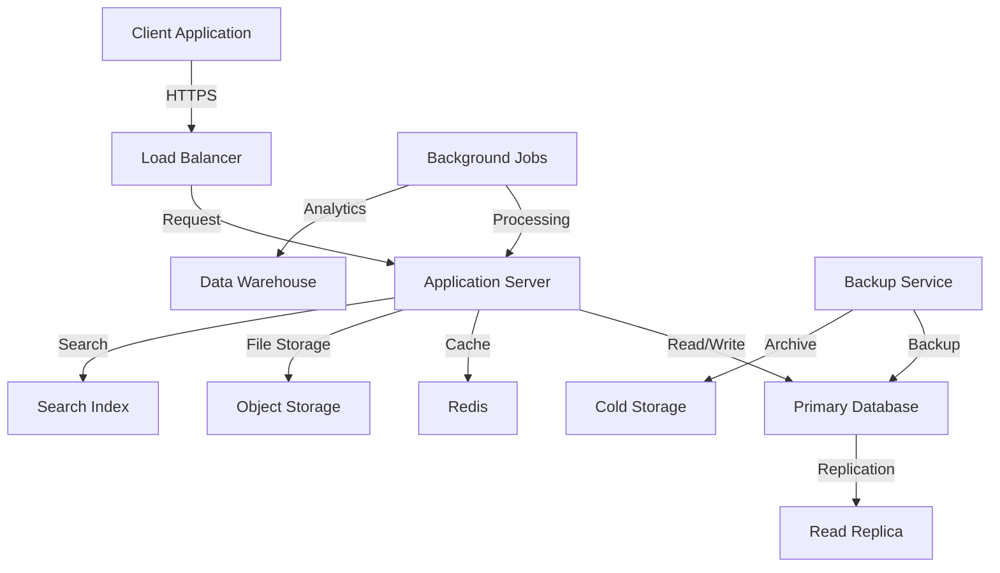

# Product Requirements Document (PRD)

# 1. INTRODUCTION

## 1.1 Purpose
This Software Requirements Specification (SRS) document provides a comprehensive description of the Task Management System. It details the functional and non-functional requirements for the web application's development and implementation. This document serves as the primary reference for technical and non-technical stakeholders including:
- Development team members
- Project managers
- Quality assurance testers
- Business stakeholders
- System administrators
- End users

## 1.2 Scope
The Task Management System is a web-based application designed to streamline task and project organization for individuals and teams. The system encompasses:

### Core Functionalities
- Task creation, assignment, and management
- Project organization and categorization
- Real-time collaboration and updates
- File attachment and sharing capabilities
- Role-based access control
- Progress tracking and monitoring
- Dashboard visualization
- Reporting and analytics

### Benefits
- Improved team collaboration and communication
- Enhanced task visibility and accountability
- Streamlined project organization
- Increased productivity through centralized management
- Better resource allocation and workload management
- Data-driven decision making through analytics
- Reduced administrative overhead

### Limitations
- Requires internet connectivity for access
- Limited to web browser-based interactions
- Storage capacity subject to system limitations
- Real-time updates dependent on server synchronization

# 2. PRODUCT DESCRIPTION

## 2.1 Product Perspective
The Task Management System operates as a standalone web application while integrating with existing enterprise infrastructure:

- **Architecture**: Cloud-based, multi-tier web application
- **User Interface**: Browser-based responsive design supporting desktop and mobile devices
- **Data Storage**: Centralized database system for task and user information
- **Integration Points**:
  - Email systems for notifications
  - Calendar applications for deadline synchronization
  - Cloud storage services for file attachments
  - Single Sign-On (SSO) systems for enterprise authentication

## 2.2 Product Functions
The system provides the following core functions:

| Function Category | Key Features |
|------------------|--------------|
| Task Management | - Create, edit, and delete tasks<br>- Set priorities and due dates<br>- Assign tasks to team members<br>- Track task status and progress |
| Project Organization | - Create and manage projects<br>- Organize tasks into projects<br>- Set project milestones<br>- Monitor project timelines |
| Collaboration | - Real-time updates and notifications<br>- Comment and discussion threads<br>- File sharing and attachments<br>- @mentions and team tagging |
| Reporting | - Progress tracking dashboards<br>- Performance analytics<br>- Custom report generation<br>- Export capabilities |
| Administration | - User management<br>- Role-based access control<br>- System configuration<br>- Security settings |

## 2.3 User Characteristics

### Administrator
- IT professionals with system administration experience
- Responsible for system configuration and user management
- Requires technical expertise in web applications and security

### Project Manager
- Professional project management background
- Needs comprehensive view of all projects and teams
- Focuses on resource allocation and progress tracking

### Team Member
- Various technical skill levels
- Primary focus on task execution and updates
- Requires minimal training for basic system usage

### Individual User
- Self-managed task organization
- Various technical proficiency levels
- Primarily uses basic task management features

## 2.4 Constraints

### Technical Constraints
- Web browsers must support HTML5 and modern JavaScript
- Minimum internet speed of 1Mbps required
- Maximum file attachment size of 25MB
- Support for latest two versions of major browsers only

### Business Constraints
- Must comply with GDPR and data protection regulations
- 99.9% system availability requirement
- Maximum 2-second response time for standard operations
- Budget limitations for third-party services

### Security Constraints
- Data encryption at rest and in transit
- Multi-factor authentication support
- Regular security audits required
- Password policy enforcement

## 2.5 Assumptions and Dependencies

### Assumptions
- Users have basic computer literacy
- Organizations have modern web browsers
- Stable internet connectivity is available
- Users have valid email addresses
- Basic understanding of task management concepts

### Dependencies
- Cloud infrastructure availability
- Third-party integration services:
  - Email service providers
  - File storage systems
  - Authentication services
- Browser compatibility
- Network infrastructure reliability
- Database management system performance

# 3. PROCESS FLOWCHART



# 4. FUNCTIONAL REQUIREMENTS

## 4.1 User Authentication and Authorization

### ID: FR-1
### Description
User authentication and access control system managing login, permissions, and security.
### Priority
High
### Requirements

| ID | Requirement | Priority |
|----|-------------|----------|
| FR-1.1 | System shall support email and password authentication | High |
| FR-1.2 | System shall implement role-based access control (Admin, Manager, Member) | High |
| FR-1.3 | System shall enforce password complexity requirements | High |
| FR-1.4 | System shall support Single Sign-On (SSO) integration | Medium |
| FR-1.5 | System shall provide password reset functionality | High |
| FR-1.6 | System shall maintain audit logs of authentication attempts | Medium |

## 4.2 Task Management

### ID: FR-2
### Description
Core task creation and management functionality including task details, status tracking, and updates.
### Priority
High
### Requirements

| ID | Requirement | Priority |
|----|-------------|----------|
| FR-2.1 | System shall allow creation of tasks with title, description, due date | High |
| FR-2.2 | System shall support task priority levels (Low, Medium, High, Urgent) | High |
| FR-2.3 | System shall enable task assignment to multiple users | High |
| FR-2.4 | System shall track task status (To Do, In Progress, Complete) | High |
| FR-2.5 | System shall support task dependencies | Medium |
| FR-2.6 | System shall allow file attachments up to 25MB per task | Medium |

## 4.3 Project Organization

### ID: FR-3
### Description
Project management capabilities including project creation, task grouping, and milestone tracking.
### Priority
High
### Requirements

| ID | Requirement | Priority |
|----|-------------|----------|
| FR-3.1 | System shall support project creation with metadata | High |
| FR-3.2 | System shall allow grouping of tasks within projects | High |
| FR-3.3 | System shall support project milestone creation | Medium |
| FR-3.4 | System shall provide project timeline visualization | Medium |
| FR-3.5 | System shall allow project template creation | Low |
| FR-3.6 | System shall support project archiving | Low |

## 4.4 Collaboration Features

### ID: FR-4
### Description
Real-time collaboration tools including comments, notifications, and file sharing.
### Priority
High
### Requirements

| ID | Requirement | Priority |
|----|-------------|----------|
| FR-4.1 | System shall support real-time task comments | High |
| FR-4.2 | System shall provide @mention notifications | High |
| FR-4.3 | System shall send email notifications for task updates | High |
| FR-4.4 | System shall support file sharing between users | Medium |
| FR-4.5 | System shall provide activity feed of recent changes | Medium |
| FR-4.6 | System shall support team chat functionality | Low |

## 4.5 Dashboard and Reporting

### ID: FR-5
### Description
Analytics and reporting functionality including dashboards, metrics, and export capabilities.
### Priority
Medium
### Requirements

| ID | Requirement | Priority |
|----|-------------|----------|
| FR-5.1 | System shall provide customizable dashboards | High |
| FR-5.2 | System shall generate performance analytics | Medium |
| FR-5.3 | System shall support custom report creation | Medium |
| FR-5.4 | System shall allow data export in multiple formats | Medium |
| FR-5.5 | System shall track time spent on tasks | Low |
| FR-5.6 | System shall provide burndown charts for projects | Low |

## 4.6 System Administration

### ID: FR-6
### Description
Administrative functions including user management, system configuration, and maintenance.
### Priority
High
### Requirements

| ID | Requirement | Priority |
|----|-------------|----------|
| FR-6.1 | System shall provide user management interface | High |
| FR-6.2 | System shall allow role configuration | High |
| FR-6.3 | System shall support system-wide announcements | Medium |
| FR-6.4 | System shall provide backup and restore capabilities | High |
| FR-6.5 | System shall allow customization of system settings | Medium |
| FR-6.6 | System shall maintain system logs | Medium |

# 5. NON-FUNCTIONAL REQUIREMENTS

## 5.1 Performance Requirements

| ID | Requirement | Target Metric |
|----|-------------|---------------|
| NFR-1.1 | Page load time | < 2 seconds for standard operations |
| NFR-1.2 | API response time | < 500ms for 95% of requests |
| NFR-1.3 | Concurrent users | Support minimum 1000 simultaneous users |
| NFR-1.4 | Database queries | < 100ms for 90% of queries |
| NFR-1.5 | File upload speed | Process 25MB file in < 30 seconds |
| NFR-1.6 | Memory usage | < 2GB RAM per application instance |
| NFR-1.7 | CPU utilization | < 70% under normal load |

## 5.2 Safety Requirements

| ID | Requirement | Description |
|----|-------------|-------------|
| NFR-2.1 | Data backup | Automated daily backups with 30-day retention |
| NFR-2.2 | Disaster recovery | Recovery Point Objective (RPO) of 24 hours |
| NFR-2.3 | System redundancy | Failover capability with hot standby |
| NFR-2.4 | Data validation | Input validation for all user-submitted data |
| NFR-2.5 | Error handling | Graceful error handling with user notifications |
| NFR-2.6 | Session management | Automatic session timeout after 30 minutes |

## 5.3 Security Requirements

| ID | Requirement | Description |
|----|-------------|-------------|
| NFR-3.1 | Data encryption | TLS 1.3 for data in transit; AES-256 for data at rest |
| NFR-3.2 | Authentication | Multi-factor authentication support |
| NFR-3.3 | Password policy | Minimum 12 characters with complexity requirements |
| NFR-3.4 | Access control | Role-based access control with principle of least privilege |
| NFR-3.5 | Audit logging | Comprehensive logging of all security events |
| NFR-3.6 | Vulnerability scanning | Weekly automated security scans |
| NFR-3.7 | Data privacy | Data anonymization for reporting and analytics |

## 5.4 Quality Requirements

### 5.4.1 Availability
- System uptime: 99.9% excluding planned maintenance
- Planned maintenance windows: Monthly, not exceeding 4 hours
- Maximum unplanned downtime: 8 hours per quarter

### 5.4.2 Maintainability
- Code documentation coverage: Minimum 80%
- Modular architecture with loose coupling
- Automated deployment process
- Version control with feature branching

### 5.4.3 Usability
- Intuitive interface requiring < 2 hours of training
- Support for multiple languages
- Responsive design for all screen sizes
- Accessibility compliance with WCAG 2.1 Level AA

### 5.4.4 Scalability
- Horizontal scaling capability
- Auto-scaling based on load metrics
- Database partitioning support
- Microservices architecture ready

### 5.4.5 Reliability
- Mean Time Between Failures (MTBF): > 720 hours
- Mean Time To Recovery (MTTR): < 2 hours
- Error rate: < 0.1% of all transactions
- Data consistency check mechanisms

## 5.5 Compliance Requirements

| ID | Requirement | Description |
|----|-------------|-------------|
| NFR-5.1 | GDPR compliance | Data protection and privacy measures |
| NFR-5.2 | CCPA compliance | California Consumer Privacy Act requirements |
| NFR-5.3 | SOC 2 Type II | Security, availability, and confidentiality controls |
| NFR-5.4 | ISO 27001 | Information security management standards |
| NFR-5.5 | WCAG 2.1 | Web Content Accessibility Guidelines |
| NFR-5.6 | Data retention | Configurable retention policies per regulation |
| NFR-5.7 | Audit trails | Complete audit trails for compliance reporting |

# 6. DATA REQUIREMENTS

## 6.1 Data Models



## 6.2 Data Storage

### 6.2.1 Database Requirements
- Primary database: PostgreSQL 14+ for structured data
- Redis for caching and real-time features
- Document store (MongoDB) for file metadata and unstructured data

### 6.2.2 Data Retention
- Active task and project data: Indefinite retention
- Archived projects: 3 years retention
- System logs: 1 year retention
- Audit trails: 7 years retention
- Deleted items: 30-day soft delete period

### 6.2.3 Backup and Recovery
- Full daily backups with point-in-time recovery
- Transaction log backups every 15 minutes
- Cross-region backup replication
- Maximum backup retention: 30 days
- Recovery Time Objective (RTO): 4 hours
- Recovery Point Objective (RPO): 15 minutes

### 6.2.4 Data Redundancy
- Active-passive database configuration
- Multi-AZ deployment
- Read replicas for reporting and analytics
- Data mirroring with synchronous replication

## 6.3 Data Processing

### 6.3.1 Data Flow



### 6.3.2 Data Security
- Encryption at rest using AES-256
- TLS 1.3 for data in transit
- Column-level encryption for sensitive data
- Data masking for non-production environments
- Regular data integrity checks
- Automated vulnerability scanning

### 6.3.3 Data Processing Requirements
- Real-time task updates and notifications
- Asynchronous file processing
- Batch processing for reports
- Event-driven architecture for system updates
- Data validation and sanitization
- Rate limiting for API requests

### 6.3.4 Data Integration
- RESTful API for external system integration
- Webhook support for event notifications
- Batch import/export capabilities
- ETL processes for reporting
- API rate limits: 1000 requests per minute per client
- Maximum payload size: 10MB for API requests

# 7. EXTERNAL INTERFACES

## 7.1 User Interfaces

### 7.1.1 General Requirements
- Responsive web design supporting viewport sizes from 320px to 4K
- Support for modern web browsers (Chrome, Firefox, Safari, Edge)
- WCAG 2.1 Level AA compliance
- Dark and light theme support
- Consistent navigation pattern across all pages

### 7.1.2 Key Interface Components

| Component | Requirements |
|-----------|--------------|
| Dashboard | - Customizable widget layout<br>- Task status overview<br>- Project progress charts<br>- Recent activity feed |
| Task Views | - List view with sorting/filtering<br>- Kanban board view<br>- Calendar view<br>- Gantt chart view |
| Forms | - Inline editing capability<br>- Real-time validation<br>- Auto-save functionality<br>- Dynamic form fields |
| Navigation | - Collapsible sidebar menu<br>- Quick search functionality<br>- Breadcrumb navigation<br>- Context-sensitive actions |

### 7.1.3 Interface Mockup Placeholders
```
[Dashboard Layout]
+-----------------+------------------+
|  Navigation     |  Task Overview   |
|                 |                  |
|  * Projects     |  [Status Chart]  |
|  * Tasks        |                  |
|  * Reports      |  [Activity Feed] |
|  * Settings     |                  |
+-----------------+------------------+

[Task Detail View]
+----------------------------------+
|  Task Title    [Priority Badge]   |
|  Description                      |
|  Assignees     Due Date          |
|  [Comments]    [Attachments]     |
+----------------------------------+
```

## 7.2 Hardware Interfaces

### 7.2.1 Client Hardware
- Minimum display resolution: 1280x720
- Touch screen support for mobile/tablet devices
- Camera interface for document scanning/attachment
- Storage access for file uploads

### 7.2.2 Server Hardware
- Load balancer interface
- Network interface cards (10Gbps)
- Storage system interface (SAN/NAS)
- Backup system interface

## 7.3 Software Interfaces

### 7.3.1 External Services Integration

| Service Type | Interface Specifications |
|--------------|-------------------------|
| Email Service | - SMTP/IMAP protocols<br>- API integration with SendGrid/AWS SES<br>- HTML email template support |
| File Storage | - AWS S3 API compatibility<br>- Azure Blob Storage interface<br>- WebDAV protocol support |
| Authentication | - OAuth 2.0 protocol<br>- SAML 2.0 for SSO<br>- OpenID Connect support |
| Calendar | - CalDAV protocol<br>- iCal format support<br>- Google Calendar API |

### 7.3.2 Database Interfaces
- PostgreSQL wire protocol (port 5432)
- Redis protocol (port 6379)
- MongoDB wire protocol (port 27017)

### 7.3.3 Operating System Interfaces
- Linux system calls for server deployment
- File system access for temporary storage
- Process management interface
- Network stack interface

## 7.4 Communication Interfaces

### 7.4.1 Network Protocols

| Protocol | Usage |
|----------|-------|
| HTTPS | - Primary application protocol<br>- TLS 1.3 required<br>- Certificate-based authentication |
| WebSocket | - Real-time updates<br>- Bi-directional communication<br>- Automatic reconnection |
| REST | - API communications<br>- JSON data format<br>- HTTP/2 support |
| GraphQL | - Complex data queries<br>- Subscription support<br>- Schema-based interface |

### 7.4.2 API Specifications

| API Type | Requirements |
|----------|--------------|
| REST API | - OpenAPI 3.0 specification<br>- JSON/XML response formats<br>- Rate limiting headers<br>- Authentication tokens |
| WebSocket | - Socket.io protocol<br>- Binary message support<br>- Heartbeat mechanism<br>- Connection pooling |
| Webhooks | - HTTPS endpoints<br>- Retry mechanism<br>- Event signature validation<br>- Payload size limits |

### 7.4.3 Integration Protocols
- LDAP for directory services
- SMTP for email notifications
- RSS/Atom feeds for activity streams
- WebDAV for file management

# 8. APPENDICES

## 8.1 GLOSSARY

| Term | Definition |
|------|------------|
| Burndown Chart | A graphical representation of work left to do versus time |
| Kanban Board | Visual workflow tool that displays tasks in columns representing different stages |
| Milestone | A significant point or event in a project timeline |
| Sprint | A fixed time period during which specific work must be completed |
| Story Points | Unit of measure for expressing effort required to implement a task |
| Time Boxing | Allocating a fixed time period to an activity |
| Webhook | Automated message sent from apps when something happens |
| Widget | A standalone application that can be embedded into third party sites |
| Workflow | A sequence of steps describing how tasks move through the system |

## 8.2 ACRONYMS

| Acronym | Definition |
|---------|------------|
| API | Application Programming Interface |
| CCPA | California Consumer Privacy Act |
| GDPR | General Data Protection Regulation |
| LDAP | Lightweight Directory Access Protocol |
| MTBF | Mean Time Between Failures |
| MTTR | Mean Time To Recovery |
| REST | Representational State Transfer |
| RPO | Recovery Point Objective |
| RTO | Recovery Time Objective |
| SAML | Security Assertion Markup Language |
| SAN | Storage Area Network |
| SES | Simple Email Service |
| SOC | System and Organization Controls |
| SSO | Single Sign-On |
| TLS | Transport Layer Security |
| WCAG | Web Content Accessibility Guidelines |

## 8.3 ADDITIONAL REFERENCES

| Reference | Description | URL |
|-----------|-------------|-----|
| PostgreSQL Documentation | Official documentation for PostgreSQL 14 | https://www.postgresql.org/docs/14/index.html |
| Redis Documentation | Official Redis documentation | https://redis.io/documentation |
| OAuth 2.0 Specification | Authorization framework specification | https://oauth.net/2/ |
| WebSocket Protocol | RFC 6455 WebSocket Protocol specification | https://tools.ietf.org/html/rfc6455 |
| Docker Documentation | Container platform documentation | https://docs.docker.com/ |
| WCAG Guidelines | Web accessibility guidelines | https://www.w3.org/WAI/standards-guidelines/wcag/ |
| AWS S3 API Reference | Amazon S3 API documentation | https://docs.aws.amazon.com/AmazonS3/latest/API/Welcome.html |
| Socket.io Documentation | Real-time application framework | https://socket.io/docs/v4 |