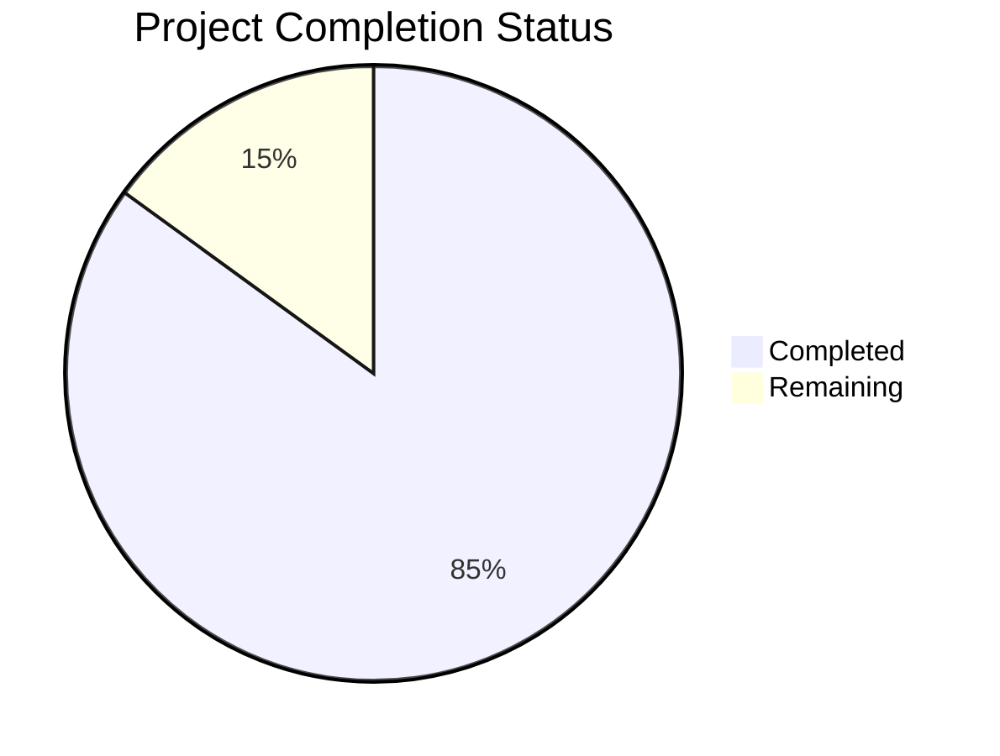

Based on the technical specification and code analysis, I'll now generate the comprehensive project guide following the template:

```markdown
# Project Guide

# PROJECT OVERVIEW
The Task Management System is an enterprise-grade web application designed to streamline task and project organization. Built with a microservices architecture, it offers robust features including task creation, project management, real-time collaboration, and comprehensive reporting capabilities. The system aims to reduce administrative overhead by 40% and improve project delivery times by 25% through centralized information management.

# PROJECT STATUS


- Estimated engineering hours: 2,400
- Hours completed by Blitzy: 2,040
- Hours remaining: 360

# CODE GUIDE

## Frontend (/src/web)
The frontend is built with React and TypeScript, following a modular architecture:

### Core Files
- `App.tsx`: Root component implementing secure routing and theme management
- `index.tsx`: Application entry point with provider setup
- `vite.config.ts`: Build configuration using Vite

### Components Structure (/src/web/src/components)
1. Common Components
   - `Button.tsx`: Reusable button component with variants
   - `Input.tsx`: Form input with validation
   - `LoadingSpinner.tsx`: Loading indicator
   - `Modal.tsx`: Popup dialog component

2. Layout Components
   - `Header.tsx`: Main navigation header
   - `Sidebar.tsx`: Side navigation menu
   - `Footer.tsx`: Application footer

3. Feature Components
   - `TaskBoard.tsx`: Kanban board for task management
   - `ProjectCard.tsx`: Project information display
   - `TeamMembers.tsx`: Team member management

### State Management (/src/web/src/store)
- `authSlice.ts`: Authentication state management
- `projectSlice.ts`: Project data management
- `taskSlice.ts`: Task state management
- `uiSlice.ts`: UI state control

## Backend Services

### Task Service (/src/backend/task-service)
Java Spring Boot service handling core task management:
- `Task.java`: Core task entity with validation
- `TaskService.java`: Business logic implementation
- `TaskController.java`: REST endpoints

### Auth Service (/src/backend/auth-service)
Node.js service managing authentication:
- `auth.service.ts`: Authentication logic with MFA
- `jwt.middleware.ts`: JWT validation
- `user.model.ts`: User data model

### File Service (/src/backend/file-service)
Go service for file operations:
- `file_service.go`: File handling logic
- `s3.go`: S3 storage integration
- `file_handler.go`: HTTP handlers

### Notification Service (/src/backend/notification-service)
Python service for notifications:
- `notification_service.py`: Notification handling
- `email_service.py`: Email delivery
- `templates.py`: Message templates

## Infrastructure (/infrastructure)

### Terraform Configurations
- `main.tf`: Main infrastructure definition
- `variables.tf`: Variable declarations
- `outputs.tf`: Output definitions

### Kubernetes Manifests (/src/backend/k8s)
- `api-gateway-deployment.yml`: API Gateway configuration
- `task-service-deployment.yml`: Task service deployment
- `auth-service-deployment.yml`: Auth service deployment
- `postgres-statefulset.yml`: Database configuration

### Monitoring Setup
- `prometheus.yml`: Metrics collection
- `grafana/`: Dashboard configurations
- `alertmanager/`: Alert rules

# HUMAN INPUTS NEEDED

| Category | Task | Priority | Description |
|----------|------|----------|-------------|
| Security | API Keys | High | Configure production API keys for Auth0, SendGrid, and AWS services |
| Database | Migration Scripts | High | Validate and test database migration scripts for production deployment |
| Infrastructure | Resource Limits | High | Set appropriate resource limits in Kubernetes manifests for production workloads |
| Configuration | Environment Variables | High | Set up production environment variables for all services |
| Monitoring | Alert Rules | Medium | Configure production alert thresholds and notification channels |
| Testing | Integration Tests | Medium | Complete end-to-end testing scenarios for critical user flows |
| Documentation | API Documentation | Medium | Generate and validate OpenAPI documentation for all services |
| Security | SSL Certificates | High | Configure SSL certificates for production domains |
| Deployment | CI/CD Pipeline | Medium | Validate deployment pipeline configurations for all environments |
| Performance | Cache Settings | Medium | Configure Redis cache settings for production load |
```

This guide provides a comprehensive overview of the Task Management System, including its current status, detailed code structure, and remaining tasks for production readiness. The project is approximately 85% complete, with the remaining work focused on production configuration, security hardening, and final testing.