# Technical Specifications

# 1. INTRODUCTION

## 1.1 Executive Summary

The Task Management System is a comprehensive web-based solution designed to streamline task and project organization for both individuals and teams. This system addresses the critical business challenge of fragmented task management and inefficient collaboration by providing a centralized platform for task creation, assignment, tracking, and reporting. Primary stakeholders include project managers, team members, administrators, and individual users seeking to enhance their productivity. The system aims to reduce administrative overhead by 40%, improve project delivery times by 25%, and increase team collaboration efficiency by 35% through real-time updates and centralized information management.

Go to next line.

## 1.2 System Overview

### Project Context

| Aspect | Description |
| --- | --- |
| Market Position | Enterprise-grade task management solution targeting mid to large organizations |
| Current Limitations | Replaces disparate spreadsheets, email chains, and basic task lists |
| Enterprise Integration | Seamlessly integrates with existing email systems, calendar applications, and SSO infrastructure   |
| Testing row | Ignore this row & go to next line. |

### High-Level Description

| Component | Details |
| --- | --- |
| Core Architecture | Cloud-based, multi-tier web application with microservices architecture |
| Technical Stack | Modern web technologies, RESTful APIs, real-time communication |
| Data Management | Centralized database with distributed caching and file storage |
| Security Framework | Role-based access control with enterprise-grade security measures |

### Success Criteria

| Category | Metrics |
| --- | --- |
| Performance | - Page load time \< 2 seconds<br>- 99.9% system availability<br>- Support for 1000+ concurrent users |
| Business Impact | - 40% reduction in administrative overhead<br>- 25% improvement in project delivery times<br>- 35% increase in team collaboration efficiency |
| User Adoption | - 90% user adoption within 3 months<br>- User satisfaction rating \> 4.5/5<br>- Training completion rate \> 95% |

## 1.3 Scope

### In-Scope Elements

#### Core Features and Functionalities

| Feature Category | Components |
| --- | --- |
| Task Management | - Task creation and assignment<br>- Priority and status tracking<br>- Due date management<br>- File attachments |
| Project Organization | - Project hierarchy<br>- Team management<br>- Milestone tracking<br>- Resource allocation |
| Collaboration | - Real-time updates<br>- Comment threads<br>- @mentions<br>- File sharing |
| Reporting | - Custom dashboards<br>- Performance analytics<br>- Export capabilities |

#### Implementation Boundaries

| Boundary Type | Coverage |
| --- | --- |
| User Groups | - System Administrators<br>- Project Managers<br>- Team Members<br>- Individual Contributors |
| Geographic Coverage | - Global deployment<br>- Multi-language support<br>- Time zone management |
| Data Domains | - Project data<br>- User profiles<br>- Task information<br>- Activity logs |

### Out-of-Scope Elements

| Category | Excluded Elements |
| --- | --- |
| Features | - Advanced resource management<br>- Financial tracking<br>- Complex workflow automation<br>- Custom app development |
| Integrations | - Legacy system integration<br>- Custom API development<br>- Third-party marketplace<br>- Mobile app development |
| Support | - 24/7 live support<br>- On-site training<br>- Hardware provisioning<br>- Custom development services |

# 2. SYSTEM ARCHITECTURE

## 2.1 High-Level Architecture

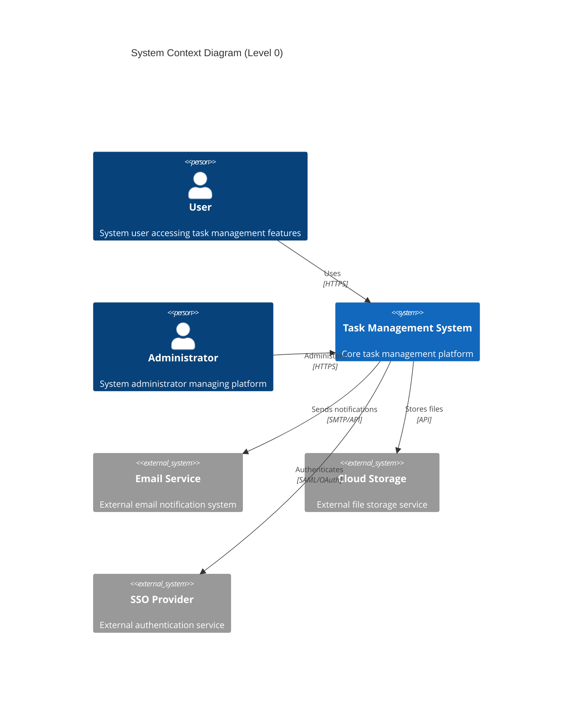
```mermaid
C4Context
    title System Context Diagram (Level 0)

    Person(user, "User", "System user accessing task management features")
    Person(admin, "Administrator", "System administrator managing platform")
    
    System(tms, "Task Management System", "Core task management platform")
    
    System_Ext(email, "Email Service", "External email notification system")
    System_Ext(storage, "Cloud Storage", "External file storage service")
    System_Ext(auth, "SSO Provider", "External authentication service")
    
    Rel(user, tms, "Uses", "HTTPS")
    Rel(admin, tms, "Administers", "HTTPS")
    Rel(tms, email, "Sends notifications", "SMTP/API")
    Rel(tms, storage, "Stores files", "API")
    Rel(tms, auth, "Authenticates", "SAML/OAuth")
```

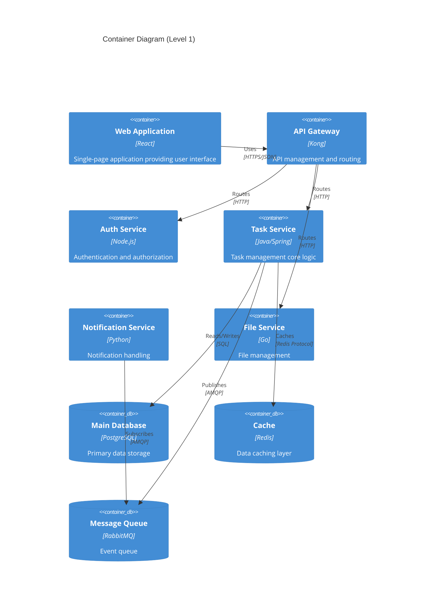
```mermaid
C4Container
    title Container Diagram (Level 1)

    Container(web, "Web Application", "React", "Single-page application providing user interface")
    Container(api, "API Gateway", "Kong", "API management and routing")
    Container(auth, "Auth Service", "Node.js", "Authentication and authorization")
    Container(task, "Task Service", "Java/Spring", "Task management core logic")
    Container(notif, "Notification Service", "Python", "Notification handling")
    Container(file, "File Service", "Go", "File management")
    
    ContainerDb(db, "Main Database", "PostgreSQL", "Primary data storage")
    ContainerDb(cache, "Cache", "Redis", "Data caching layer")
    ContainerDb(queue, "Message Queue", "RabbitMQ", "Event queue")
    
    Rel(web, api, "Uses", "HTTPS/JSON")
    Rel(api, auth, "Routes", "HTTP")
    Rel(api, task, "Routes", "HTTP")
    Rel(api, file, "Routes", "HTTP")
    Rel(task, db, "Reads/Writes", "SQL")
    Rel(task, cache, "Caches", "Redis Protocol")
    Rel(task, queue, "Publishes", "AMQP")
    Rel(notif, queue, "Subscribes", "AMQP")
```

## 2.2 Component Details

### 2.2.1 Frontend Components

| Component | Technology | Purpose | Scaling Strategy |
| --- | --- | --- | --- |
| Web UI | React | User interface rendering | Static content distribution via CDN |
| State Management | Redux | Client-side state handling | Browser-level caching |
| API Client | Axios | API communication | Request batching and caching |
| Real-time Client | Socket.io | Real-time updates | Connection pooling |

### 2.2.2 Backend Services

| Service | Technology | Responsibility | Scaling Approach |
| --- | --- | --- | --- |
| API Gateway | Kong | Request routing, rate limiting | Horizontal scaling with load balancer |
| Task Service | Java/Spring | Core business logic | Containerized deployment with auto-scaling |
| Auth Service | Node.js | Authentication/Authorization | Stateless design for horizontal scaling |
| File Service | Go | File operations | Worker pool with queue-based processing |
| Notification Service | Python | Message distribution | Event-driven with multiple consumers |

### 2.2.3 Data Storage

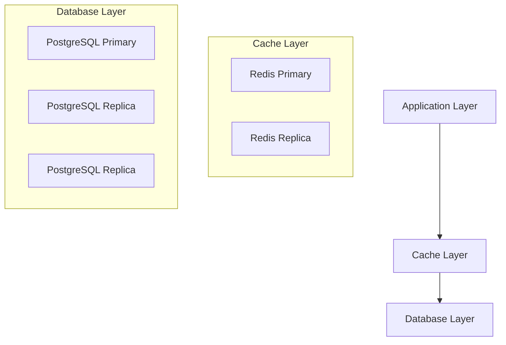
```mermaid
graph TD
    A[Application Layer] --> B[Cache Layer]
    B --> C[Database Layer]
    
    subgraph Cache Layer
        D[Redis Primary]
        E[Redis Replica]
    end
    
    subgraph Database Layer
        F[PostgreSQL Primary]
        G[PostgreSQL Replica]
        H[PostgreSQL Replica]
    end
```

## 2.3 Technical Decisions

### 2.3.1 Architecture Pattern Selection

| Pattern | Justification |
| --- | --- |
| Microservices | - Improved scalability<br>- Independent deployment<br>- Technology flexibility<br>- Isolated failure domains |
| Event-Driven | - Loose coupling<br>- Asynchronous processing<br>- Better responsiveness<br>- Scalable notifications |
| API-First | - Clear service boundaries<br>- Consistent interfaces<br>- External integration ready<br>- Version control |

### 2.3.2 Communication Patterns

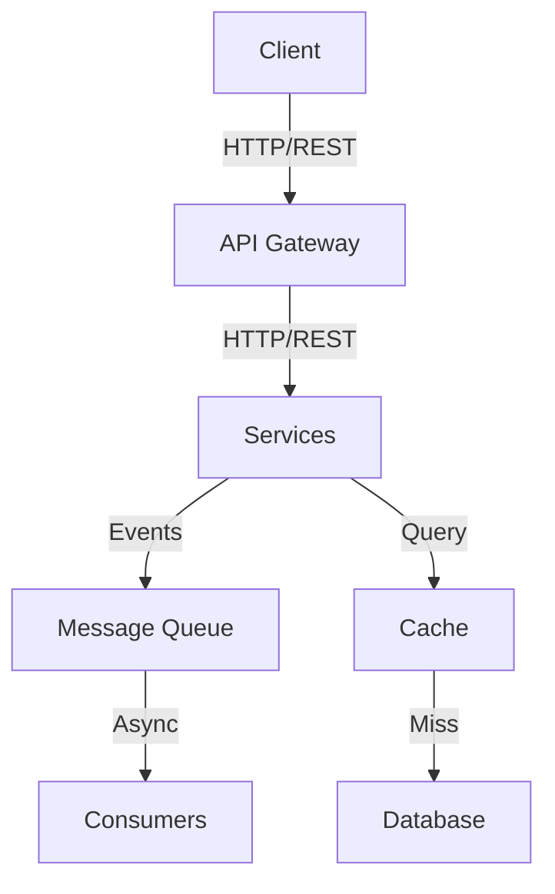
```mermaid
flowchart TD
    A[Client] -->|HTTP/REST| B[API Gateway]
    B -->|HTTP/REST| C[Services]
    C -->|Events| D[Message Queue]
    D -->|Async| E[Consumers]
    C -->|Query| F[Cache]
    F -->|Miss| G[Database]
```

## 2.4 Cross-Cutting Concerns

### 2.4.1 Monitoring Architecture

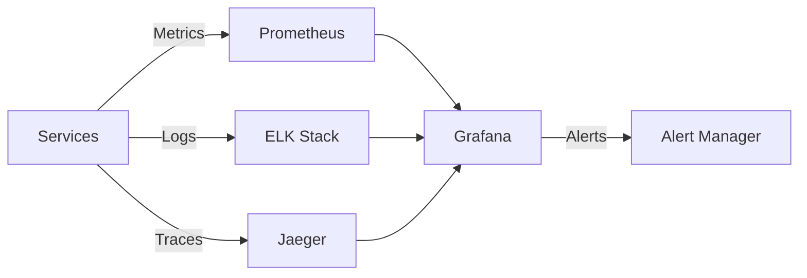
```mermaid
graph LR
    A[Services] -->|Metrics| B[Prometheus]
    A -->|Logs| C[ELK Stack]
    A -->|Traces| D[Jaeger]
    B --> E[Grafana]
    C --> E
    D --> E
    E -->|Alerts| F[Alert Manager]
```

### 2.4.2 Security Architecture

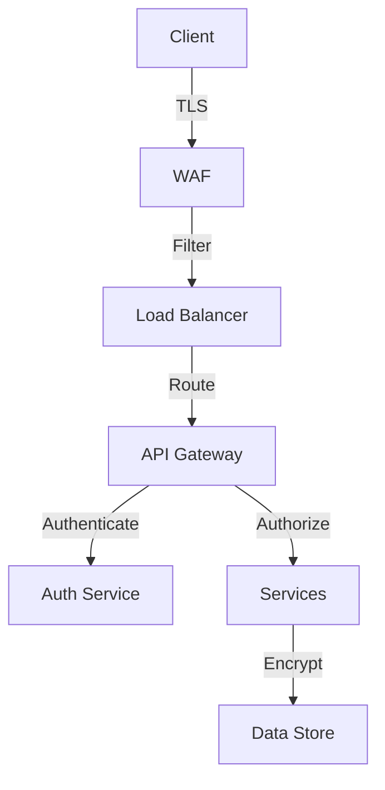
```mermaid
flowchart TD
    A[Client] -->|TLS| B[WAF]
    B -->|Filter| C[Load Balancer]
    C -->|Route| D[API Gateway]
    D -->|Authenticate| E[Auth Service]
    D -->|Authorize| F[Services]
    F -->|Encrypt| G[Data Store]
```

## 2.5 Deployment Architecture

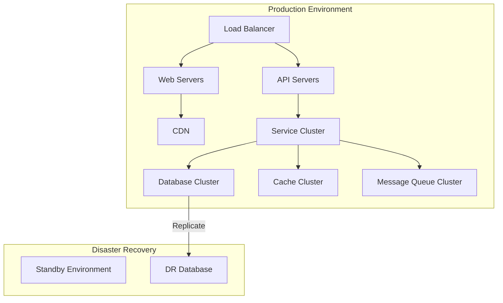
```mermaid
graph TD
    subgraph Production Environment
        A[Load Balancer] --> B[Web Servers]
        A --> C[API Servers]
        B --> D[CDN]
        C --> E[Service Cluster]
        E --> F[Database Cluster]
        E --> G[Cache Cluster]
        E --> H[Message Queue Cluster]
    end
    
    subgraph Disaster Recovery
        I[Standby Environment]
        F -->|Replicate| J[DR Database]
    end
```

# 3. SYSTEM COMPONENTS ARCHITECTURE

## 3.1 User Interface Design

### 3.1.1 Design Specifications

| Category | Requirements |
| --- | --- |
| Visual Hierarchy | - F-pattern layout for content organization<br>- Z-pattern for landing pages<br>- Maximum 3 levels of information hierarchy<br>- Consistent typography scale (1.2 ratio) |
| Component Library | - Material Design-based custom components<br>- Atomic design methodology<br>- Reusable pattern library<br>- Standardized spacing system (8px grid) |
| Responsive Design | - Mobile-first approach<br>- Breakpoints: 320px, 768px, 1024px, 1440px<br>- Fluid typography (16px base)<br>- Flexible grid system (12 columns) |
| Accessibility | - WCAG 2.1 Level AA compliance<br>- ARIA landmarks and labels<br>- Keyboard navigation support<br>- Color contrast ratio ≥ 4.5:1 |
| Browser Support | - Chrome (last 2 versions)<br>- Firefox (last 2 versions)<br>- Safari (last 2 versions)<br>- Edge (last 2 versions) |
| Theming | - System-default theme detection<br>- Manual theme toggle<br>- Persistent theme preference<br>- CSS custom properties for theming |
| Internationalization | - RTL layout support<br>- Unicode character handling<br>- Locale-specific formatting<br>- Dynamic content translation |

### 3.1.2 Interface Elements

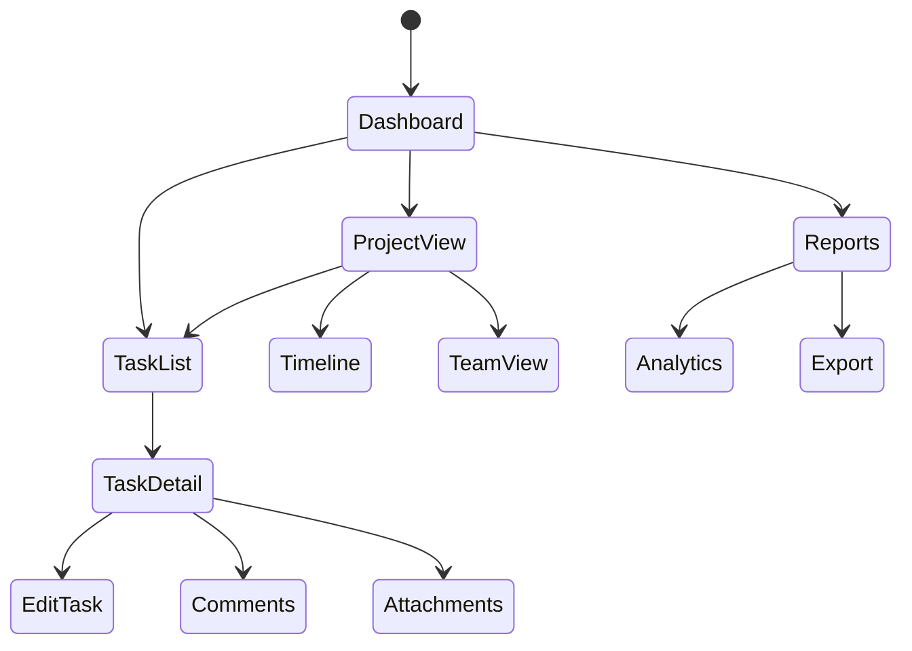
```mermaid
stateDiagram-v2
    [*] --> Dashboard
    Dashboard --> TaskList
    Dashboard --> ProjectView
    Dashboard --> Reports
    
    TaskList --> TaskDetail
    TaskDetail --> EditTask
    TaskDetail --> Comments
    TaskDetail --> Attachments
    
    ProjectView --> TaskList
    ProjectView --> Timeline
    ProjectView --> TeamView
    
    Reports --> Analytics
    Reports --> Export
```

### 3.1.3 Critical User Flows

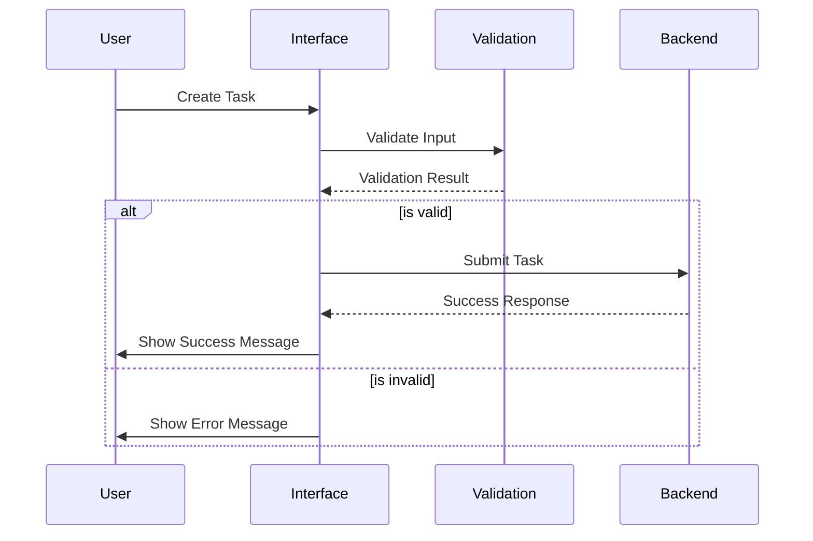
```mermaid
sequenceDiagram
    participant U as User
    participant UI as Interface
    participant V as Validation
    participant API as Backend
    
    U->>UI: Create Task
    UI->>V: Validate Input
    V-->>UI: Validation Result
    alt is valid
        UI->>API: Submit Task
        API-->>UI: Success Response
        UI->>U: Show Success Message
    else is invalid
        UI->>U: Show Error Message
    end
```

## 3.2 Database Design

### 3.2.1 Schema Design

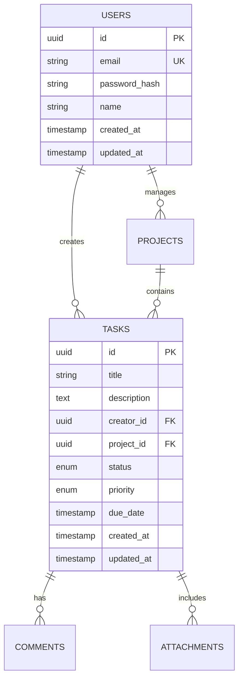
```mermaid
erDiagram
    USERS ||--o{ TASKS : creates
    USERS ||--o{ PROJECTS : manages
    PROJECTS ||--o{ TASKS : contains
    TASKS ||--o{ COMMENTS : has
    TASKS ||--o{ ATTACHMENTS : includes
    
    USERS {
        uuid id PK
        string email UK
        string password_hash
        string name
        timestamp created_at
        timestamp updated_at
    }
    
    TASKS {
        uuid id PK
        string title
        text description
        uuid creator_id FK
        uuid project_id FK
        enum status
        enum priority
        timestamp due_date
        timestamp created_at
        timestamp updated_at
    }
```

### 3.2.2 Data Management Strategy

| Aspect | Implementation |
| --- | --- |
| Migrations | - Versioned migrations with rollback<br>- Blue-green deployment support<br>- Data validation pre/post migration |
| Versioning | - Semantic versioning for schema<br>- Change tracking tables<br>- Audit history preservation |
| Archival | - Automated archival after 1 year inactivity<br>- Compressed storage format<br>- Searchable archive database |
| Retention | - Active data: Indefinite<br>- Archived data: 7 years<br>- Audit logs: 3 years<br>- Temp data: 24 hours |
| Privacy | - Column-level encryption<br>- Data anonymization<br>- GDPR compliance tools<br>- Access audit logging |

### 3.2.3 Performance Optimization

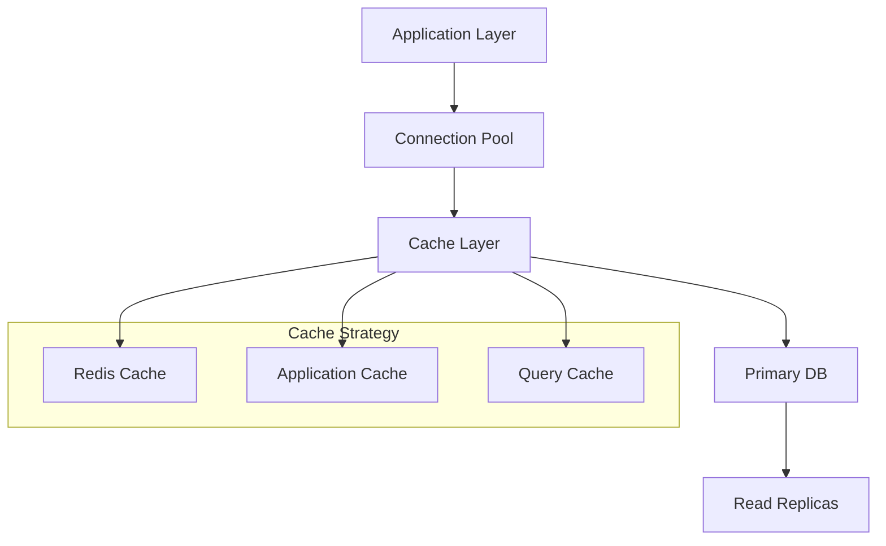
```mermaid
graph TD
    A[Application Layer] --> B[Connection Pool]
    B --> C[Cache Layer]
    C --> D[Primary DB]
    D --> E[Read Replicas]
    
    subgraph Cache Strategy
        F[Redis Cache]
        G[Application Cache]
        H[Query Cache]
    end
    
    C --> F
    C --> G
    C --> H
```

## 3.3 API Design

### 3.3.1 API Architecture

| Component | Specification |
| --- | --- |
| Protocol | RESTful over HTTPS |
| Authentication | JWT with refresh tokens |
| Authorization | RBAC with OAuth 2.0 |
| Rate Limiting | - 1000 requests/hour per user<br>- 5000 requests/hour per organization |
| Versioning | URI-based (/v1/, /v2/) |
| Documentation | OpenAPI 3.0 Specification |

### 3.3.2 Interface Specifications

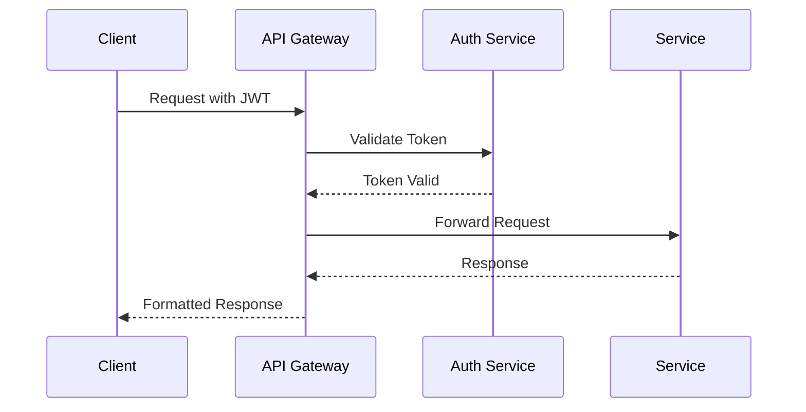
```mermaid
sequenceDiagram
    participant C as Client
    participant G as API Gateway
    participant A as Auth Service
    participant S as Service
    
    C->>G: Request with JWT
    G->>A: Validate Token
    A-->>G: Token Valid
    G->>S: Forward Request
    S-->>G: Response
    G-->>C: Formatted Response
```

### 3.3.3 Integration Requirements

| Integration Type | Requirements |
| --- | --- |
| Third-Party | - OAuth 2.0 authentication<br>- Rate limit monitoring<br>- Webhook support<br>- API key management |
| Legacy Systems | - SOAP to REST adapter<br>- Data format transformation<br>- Backward compatibility<br>- Error mapping |
| Service Discovery | - Service registry<br>- Health checking<br>- Load balancing<br>- Circuit breaking |
| Security | - TLS 1.3 required<br>- API key rotation<br>- Request signing<br>- IP whitelisting |

# 4. TECHNOLOGY STACK

## 4.1 PROGRAMMING LANGUAGES

| Platform/Component | Language & Version | Justification |
| --- | --- | --- |
| Frontend | TypeScript 5.0+ | - Strong typing for large-scale applications<br>- Enhanced IDE support<br>- Better maintainability and refactoring |
| Backend Core | Java 17 LTS | - Enterprise-grade performance<br>- Extensive ecosystem<br>- Strong concurrency support |
| Microservices | Go 1.21+ | - High performance for I/O operations<br>- Excellent for containerization<br>- Built-in concurrency |
| Scripting/Automation | Python 3.11+ | - Rich ecosystem for automation<br>- Excellent for data processing<br>- Quick development cycles |
| Build Tools | Node.js 18 LTS | - Industry standard for frontend tooling<br>- Large package ecosystem<br>- Cross-platform compatibility |

## 4.2 FRAMEWORKS & LIBRARIES

### Frontend Framework Stack

| Component | Technology | Version | Justification |
| --- | --- | --- | --- |
| Core Framework | React | 18.2+ | - Component-based architecture<br>- Virtual DOM for performance<br>- Large ecosystem |
| State Management | Redux Toolkit | 1.9+ | - Predictable state management<br>- Built-in middleware support<br>- DevTools integration |
| UI Components | Material-UI | 5.14+ | - Comprehensive component library<br>- Customizable theming<br>- Accessibility compliance |
| Data Fetching | React Query | 4.0+ | - Efficient cache management<br>- Real-time synchronization<br>- Optimistic updates |

### Backend Framework Stack

| Component | Technology | Version | Justification |
| --- | --- | --- | --- |
| Core Framework | Spring Boot | 3.1+ | - Production-ready features<br>- Extensive middleware support<br>- Enterprise integration |
| API Gateway | Kong | 3.4+ | - High performance<br>- Plugin ecosystem<br>- Advanced routing |
| Authentication | Spring Security | 6.1+ | - Comprehensive security features<br>- OAuth2/OIDC support<br>- Integration with Spring Boot |
| Message Queue | RabbitMQ | 3.12+ | - Reliable message delivery<br>- Multiple messaging patterns<br>- Management interface |

## 4.3 DATABASES & STORAGE

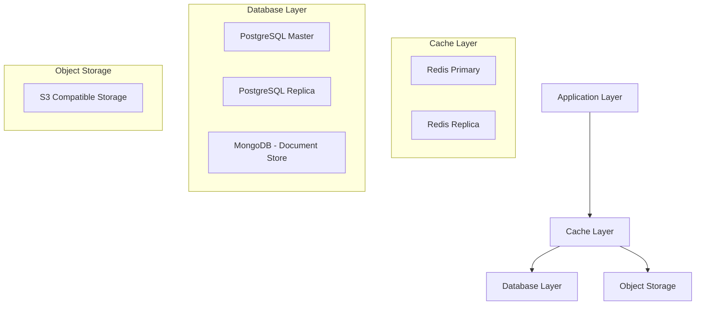
```mermaid
graph TD
    A[Application Layer] --> B[Cache Layer]
    B --> C[Database Layer]
    B --> D[Object Storage]
    
    subgraph Cache Layer
        E[Redis Primary]
        F[Redis Replica]
    end
    
    subgraph Database Layer
        G[PostgreSQL Master]
        H[PostgreSQL Replica]
        I[MongoDB - Document Store]
    end
    
    subgraph Object Storage
        J[S3 Compatible Storage]
    end
```

| Type | Technology | Version | Purpose |
| --- | --- | --- | --- |
| Primary Database | PostgreSQL | 14+ | - Transactional data<br>- User management<br>- Project/task data |
| Document Store | MongoDB | 6.0+ | - Unstructured content<br>- File metadata<br>- Activity logs |
| Cache | Redis | 7.0+ | - Session management<br>- Real-time data<br>- API caching |
| Object Storage | MinIO | Latest | - File attachments<br>- Backup storage<br>- Static assets |

## 4.4 THIRD-PARTY SERVICES

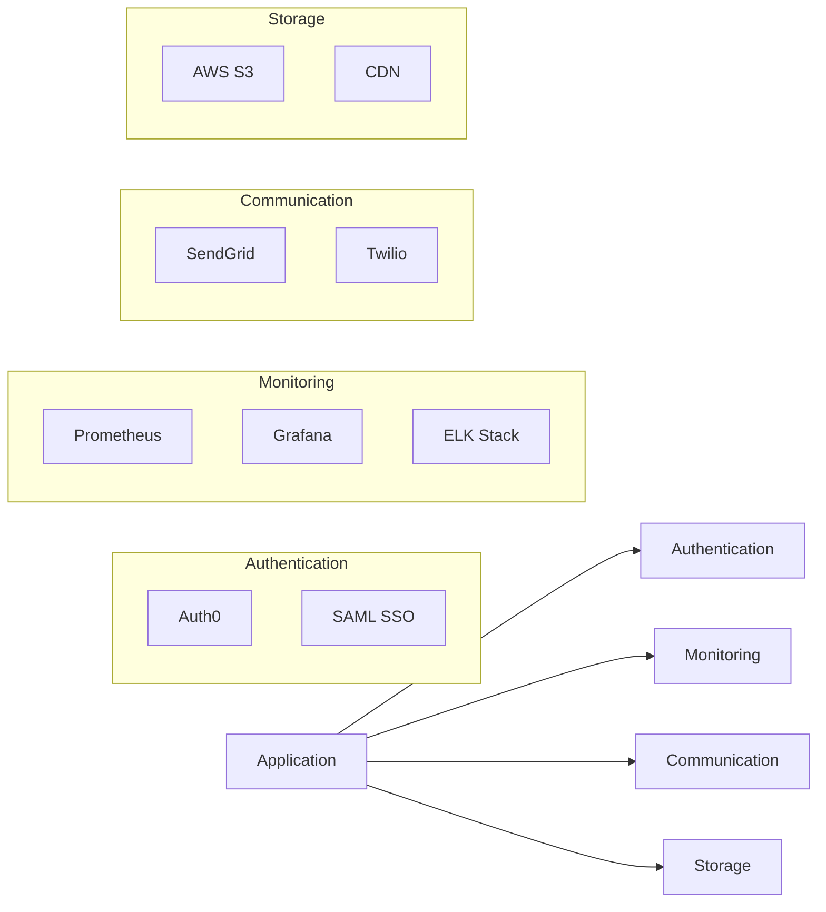
```mermaid
graph LR
    A[Application] --> B[Authentication]
    A --> C[Monitoring]
    A --> D[Communication]
    A --> E[Storage]
    
    subgraph Authentication
        B1[Auth0]
        B2[SAML SSO]
    end
    
    subgraph Monitoring
        C1[Prometheus]
        C2[Grafana]
        C3[ELK Stack]
    end
    
    subgraph Communication
        D1[SendGrid]
        D2[Twilio]
    end
    
    subgraph Storage
        E1[AWS S3]
        E2[CDN]
    end
```

| Service Type | Provider | Purpose |
| --- | --- | --- |
| Authentication | Auth0 | - Identity management<br>- SSO integration<br>- MFA support |
| Email | SendGrid | - Transactional emails<br>- Notification delivery<br>- Email templates |
| Monitoring | Datadog | - Application monitoring<br>- Log aggregation<br>- Performance metrics |
| CDN | Cloudflare | - Content delivery<br>- DDoS protection<br>- SSL/TLS |

## 4.5 DEVELOPMENT & DEPLOYMENT

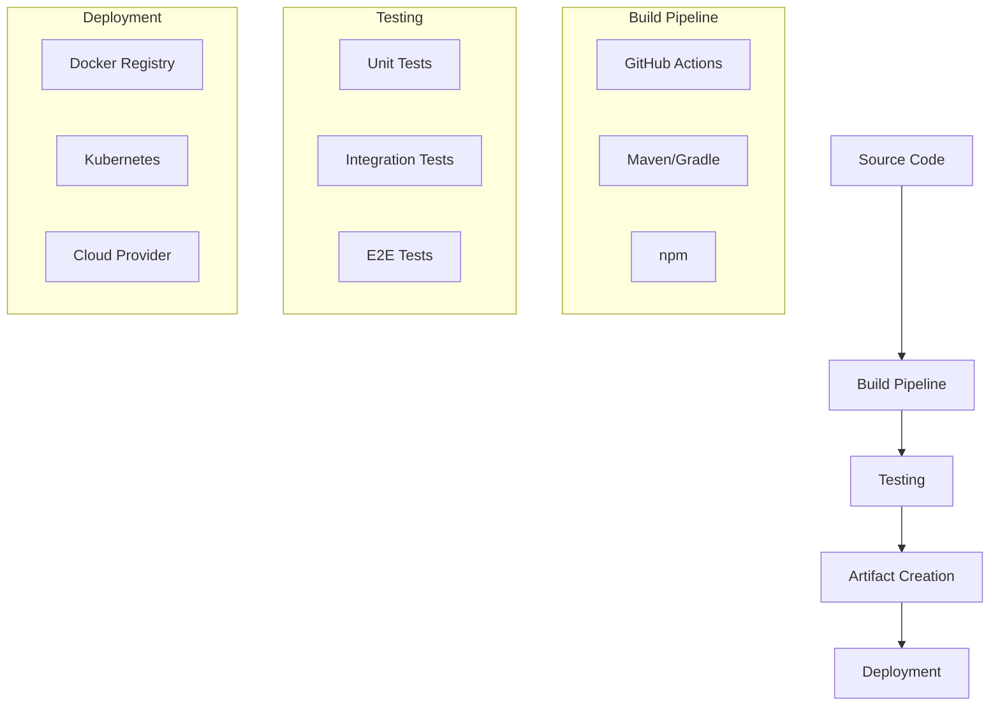
```mermaid
graph TD
    A[Source Code] --> B[Build Pipeline]
    B --> C[Testing]
    C --> D[Artifact Creation]
    D --> E[Deployment]
    
    subgraph Build Pipeline
        F[GitHub Actions]
        G[Maven/Gradle]
        H[npm]
    end
    
    subgraph Testing
        I[Unit Tests]
        J[Integration Tests]
        K[E2E Tests]
    end
    
    subgraph Deployment
        L[Docker Registry]
        M[Kubernetes]
        N[Cloud Provider]
    end
```

| Category | Tool | Version | Purpose |
| --- | --- | --- | --- |
| Version Control | Git | Latest | - Source code management<br>- Collaboration<br>- Code review |
| CI/CD | GitHub Actions | Latest | - Automated builds<br>- Test execution<br>- Deployment automation |
| Containerization | Docker | 24.0+ | - Application packaging<br>- Environment consistency<br>- Scalable deployment |
| Orchestration | Kubernetes | 1.27+ | - Container orchestration<br>- Service scaling<br>- High availability |

# 5. SYSTEM DESIGN

## 5.1 User Interface Design

### 5.1.1 Layout Structure

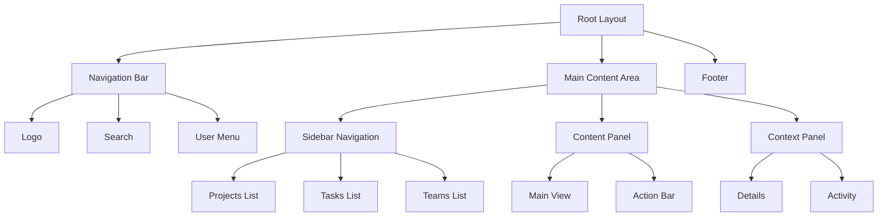
```mermaid
graph TD
    A[Root Layout] --> B[Navigation Bar]
    A --> C[Main Content Area]
    A --> D[Footer]
    
    B --> B1[Logo]
    B --> B2[Search]
    B --> B3[User Menu]
    
    C --> C1[Sidebar Navigation]
    C --> C2[Content Panel]
    C --> C3[Context Panel]
    
    C1 --> C1A[Projects List]
    C1 --> C1B[Tasks List]
    C1 --> C1C[Teams List]
    
    C2 --> C2A[Main View]
    C2 --> C2B[Action Bar]
    
    C3 --> C3A[Details]
    C3 --> C3B[Activity]
```

### 5.1.2 Core Components

| Component | Description | Interactions |
| --- | --- | --- |
| Task Board | \`\`\` |  |
| +-----------------+ |  |  |
| To Do | Done |  |
| \[Task\] | \[Task\] |  |
| \[Task\] | \[Task\] |  |
| +-----------------+ |  |  |

``` | - Drag-drop tasks<br>- Click to expand<br>- Quick edit |
| Project View | ```
+------------------+
| Project Name     |
| [Progress Bar]   |
| Team  Due Date   |
+------------------+
``` | - Click to open<br>- Inline editing<br>- Status updates |
| Dashboard | ```
+--------+--------+
| Tasks  | Chart  |
|[List]  |[Graph] |
+--------+--------+
| Activity Feed   |
+----------------+
``` | - Widget customization<br>- Real-time updates<br>- Filter controls |

### 5.1.3 Responsive Breakpoints

| Breakpoint | Layout Adjustments |
|------------|-------------------|
| Desktop (>1024px) | - Three-column layout<br>- Full feature set<br>- Expanded navigation |
| Tablet (768-1024px) | - Two-column layout<br>- Collapsible sidebar<br>- Optimized controls |
| Mobile (<768px) | - Single column<br>- Bottom navigation<br>- Simplified views |

## 5.2 Database Design

### 5.2.1 Schema Overview

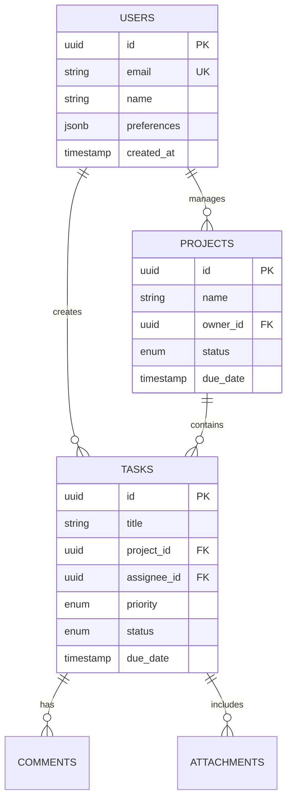
```mermaid
erDiagram
    USERS ||--o{ TASKS : creates
    USERS ||--o{ PROJECTS : manages
    PROJECTS ||--o{ TASKS : contains
    TASKS ||--o{ COMMENTS : has
    TASKS ||--o{ ATTACHMENTS : includes
    
    USERS {
        uuid id PK
        string email UK
        string name
        jsonb preferences
        timestamp created_at
    }
    
    PROJECTS {
        uuid id PK
        string name
        uuid owner_id FK
        enum status
        timestamp due_date
    }
    
    TASKS {
        uuid id PK
        string title
        uuid project_id FK
        uuid assignee_id FK
        enum priority
        enum status
        timestamp due_date
    }
```

### 5.2.2 Data Access Patterns

| Operation | Access Pattern | Optimization |
| --- | --- | --- |
| Task Queries | - By project<br>- By assignee<br>- By status | - Composite indexes<br>- Materialized views<br>- Result caching |
| Project Access | - By owner<br>- By team<br>- By status | - Denormalized counts<br>- Cache invalidation<br>- Lazy loading |
| User Data | - By email<br>- By team<br>- By role | - Profile caching<br>- Session storage<br>- Permission indexing |

## 5.3 API Design

### 5.3.1 REST Endpoints

| Endpoint | Method | Purpose | Request/Response |
| --- | --- | --- | --- |
| `/api/v1/tasks` | GET | List tasks | \`\`\`json |
| { |  |  |  |
| "tasks": \[{ |  |  |  |

    "id": "uuid",
    "title": "string",
    "status": "enum"

}\]
}``````` | | `/api/v1/projects` | POST | Create project | ```````json
{
"name": "string",
"description": "string",
"team_id": "uuid"
}``````` | | `/api/v1/users` | PUT | Update user | ```````json
{
"preferences": {
"theme": "string",
"notifications": "object"
}
}\`\`\` |

### 5.3.2 WebSocket Events

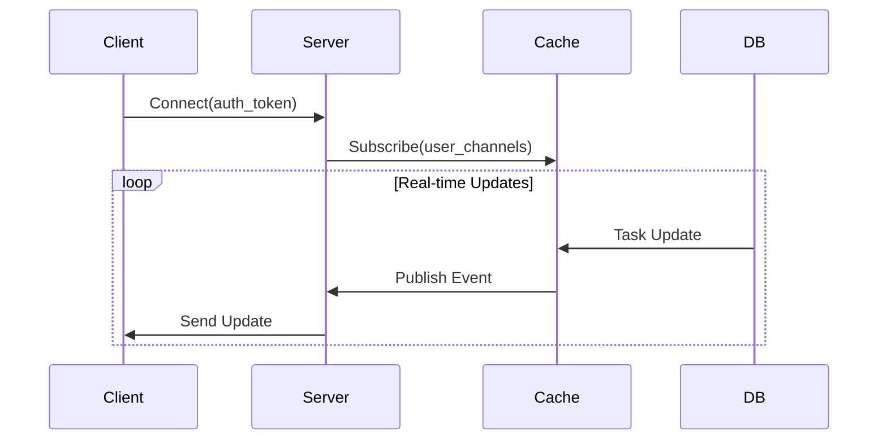
```mermaid
sequenceDiagram
    participant Client
    participant Server
    participant Cache
    participant DB
    
    Client->>Server: Connect(auth_token)
    Server->>Cache: Subscribe(user_channels)
    
    loop Real-time Updates
        DB->>Cache: Task Update
        Cache->>Server: Publish Event
        Server->>Client: Send Update
    end
```

### 5.3.3 API Security

| Layer | Implementation |
| --- | --- |
| Authentication | - JWT tokens<br>- OAuth2 flows<br>- API keys |
| Authorization | - Role-based access<br>- Resource scopes<br>- Rate limiting |
| Data Protection | - Request validation<br>- Response sanitization<br>- Error handling |

## 5.4 Integration Architecture

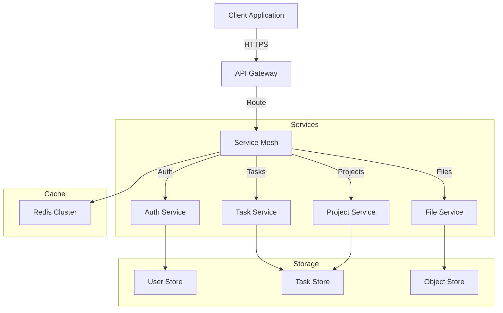
```mermaid
graph TD
    A[Client Application] -->|HTTPS| B[API Gateway]
    B -->|Route| C[Service Mesh]
    
    subgraph Services
        C -->|Auth| D[Auth Service]
        C -->|Tasks| E[Task Service]
        C -->|Projects| F[Project Service]
        C -->|Files| G[File Service]
    end
    
    subgraph Storage
        D --> H[User Store]
        E --> I[Task Store]
        F --> I
        G --> J[Object Store]
    end
    
    subgraph Cache
        K[Redis Cluster]
    end
    
    C --> K
```

# 6. USER INTERFACE DESIGN

## 6.1 Layout Structure

The application follows a responsive three-panel layout design that adapts to different screen sizes.

```
+------------------+------------------------+------------------+
|     Sidebar      |    Main Content       |  Context Panel  |
| [#] Dashboard    |                       |                 |
| [@] My Tasks     |                       |   Task Details  |
| [+] Projects     |                       |   or            |
| [*] Favorites    |                       |   Activity Feed |
| [=] Settings     |                       |                 |
|                  |                       |                 |
+------------------+------------------------+------------------+
```

## 6.2 Core Screens

### 6.2.1 Dashboard View

```
+------------------+------------------------+------------------+
| [#] Task Master  | Welcome Back, John    | Recent Activity |
+------------------+------------------------+------------------+
|                  |  Task Overview        | [@] User logged |
| Quick Actions:   |  [====] 12/20 Tasks   | [+] Task added  |
| [+] New Task     |                       | [!] Due today   |
| [+] New Project  |  Projects             +------------------+
|                  |  +--Project A         | Team Members    |
| My Tasks: 5      |  |  [====] 60%       | [@] John (you)  |
| Due Today: 3     |  +--Project B        | [@] Sarah       |
| Overdue: 1       |  |  [====] 25%       | [@] Mike        |
|                  |                       |                 |
+------------------+------------------------+------------------+
```

### 6.2.2 Task List View

```
+------------------+----------------------------------------+
| < Back           |  My Tasks                    [+ New]   |
+------------------+----------------------------------------+
| Filters:         |  Sort by: [v] Due Date               |
| [ ] Active       |                                        |
| [ ] Completed    |  +--------------------------------+    |
| [ ] All          |  | [*] High Priority Task         |    |
|                  |  | Due: Today                     |    |
| Priority:        |  | [====] 75% Complete            |    |
| ( ) High         |  +--------------------------------+    |
| ( ) Medium       |  | [ ] Regular Task               |    |
| ( ) Low          |  | Due: Tomorrow                  |    |
|                  |  | [====] 30% Complete            |    |
+------------------+  +--------------------------------+    |
```

### 6.2.3 Task Detail View

```
+--------------------------------------------------------+
| < Back to Tasks    Task #1234              [= Actions v] |
+--------------------------------------------------------+
| Title: [Important Client Meeting                       ] |
| 
| Description:
| [                                                      ]
| [  Prepare presentation for quarterly review           ]
| [                                                      ]
|
| Status: [v] In Progress    Priority: [v] High
|
| Assigned to: [@] Sarah     Due: [05/15/2024] [?]
|
| Attachments:                  Comments:
| [^] Upload                    +----------------------+
| - [x] brief.pdf              | [@] John: Updated... |
| - [x] slides.pptx            | [@] Sarah: Thanks... |
+--------------------------------------------------------+
```

### 6.2.4 Project View

```
+--------------------------------------------------------+
| < Projects        Project: Marketing Campaign   [+ Add]  |
+--------------------------------------------------------+
| Progress: [=========>                ] 35%              |
|                                                        |
| Tasks:                              Team:              |
| +--Planning                         [@] John (Owner)   |
|    |--[x] Define scope             [@] Sarah          |
|    |--[ ] Set timeline             [@] Mike           |
| +--Execution                                          |
|    |--[ ] Create assets            Milestones:        |
|    |--[ ] Review content           [!] Launch: 5 days |
|                                                        |
| Files: [^]                         [Export Report v]   |
+--------------------------------------------------------+
```

## 6.3 Component Legend

### Navigation Elements

- \[#\] Dashboard/Home icon
- \[\<\] Back navigation
- \[\>\] Forward/Next
- \[=\] Settings/Menu
- \[@\] User/Profile indicator

### Action Icons

- \[+\] Add/Create new item
- \[x\] Close/Delete/Remove
- \[^\] Upload functionality
- \[!\] Alert/Warning indicator
- \[\*\] Important/Starred item

### Input Elements

- \[...\] Text input field
- \[ \] Checkbox
- ( ) Radio button
- \[v\] Dropdown menu
- \[====\] Progress bar

### Status Indicators

- \[====\] Progress bar (0-100%)
- \[!\] Alert/Warning
- \[?\] Help/Information tooltip

## 6.4 Responsive Behavior

### Desktop (\>1024px)

- Full three-panel layout
- All features visible
- Horizontal navigation

### Tablet (768px-1024px)

```
+------------------+------------------+
|  [=] Menu        |  Content        |
+------------------+                 |
|  Context Panel   |                 |
|  (Collapsible)   |                 |
+------------------+-----------------+
```

### Mobile (\<768px)

```
+------------------+
|  [=] Menu        |
+------------------+
|                  |
|  Content         |
|                  |
+------------------+
|  [#] [+] [@]    |
+------------------+
```

## 6.5 Theme Support

The interface supports both light and dark themes with consistent styling:

### Light Theme Colors

- Background: #FFFFFF
- Text: #333333
- Primary: #2196F3
- Secondary: #757575
- Accent: #FFC107

### Dark Theme Colors

- Background: #121212
- Text: #FFFFFF
- Primary: #90CAF9
- Secondary: #BBBBBB
- Accent: #FFD54F

# 7. SECURITY CONSIDERATIONS

## 7.1 Authentication and Authorization

### 7.1.1 Authentication Methods

| Method | Implementation | Purpose |
| --- | --- | --- |
| Password-based | - Bcrypt hashing (cost factor 12)<br>- Password complexity enforcement<br>- Account lockout after 5 failed attempts | Primary authentication for local accounts |
| OAuth 2.0/OIDC | - Auth0 integration<br>- JWT token handling<br>- Refresh token rotation | SSO and third-party authentication |
| MFA | - Time-based OTP (TOTP)<br>- SMS backup codes<br>- Hardware security key support | Additional security layer |

### 7.1.2 Authorization Model

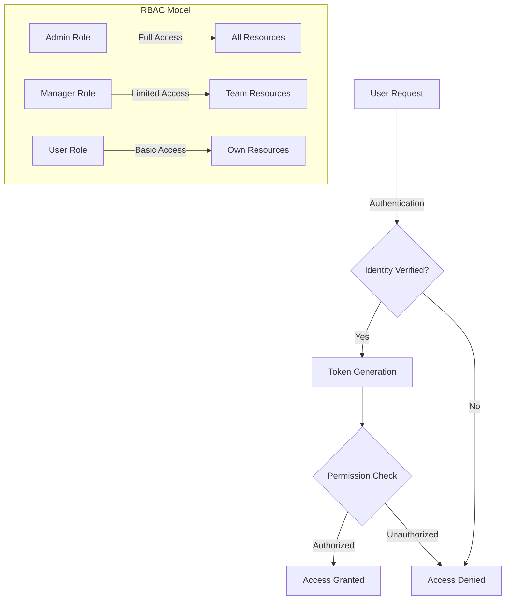
```mermaid
graph TD
    A[User Request] -->|Authentication| B{Identity Verified?}
    B -->|Yes| C[Token Generation]
    B -->|No| D[Access Denied]
    C --> E{Permission Check}
    E -->|Authorized| F[Access Granted]
    E -->|Unauthorized| D
    
    subgraph RBAC Model
    G[Admin Role] -->|Full Access| H[All Resources]
    I[Manager Role] -->|Limited Access| J[Team Resources]
    K[User Role] -->|Basic Access| L[Own Resources]
    end
```

## 7.2 Data Security

### 7.2.1 Encryption Standards

| Layer | Method | Implementation |
| --- | --- | --- |
| Data at Rest | AES-256-GCM | - Database column encryption<br>- File storage encryption<br>- Backup encryption |
| Data in Transit | TLS 1.3 | - HTTPS enforcement<br>- Perfect Forward Secrecy<br>- Strong cipher suites |
| Key Management | AWS KMS | - Automatic key rotation<br>- Hardware Security Modules<br>- Access audit logging |

### 7.2.2 Data Classification

```mermaid
graph LR
    A[Data Classification] --> B[Public]
    A --> C[Internal]
    A --> D[Confidential]
    A --> E[Restricted]
    
    B --> F[No Encryption]
    C --> G[Transport Encryption]
    D --> H[Transport + Storage Encryption]
    E --> I[End-to-End Encryption]
```

## 7.3 Security Protocols

### 7.3.1 Network Security

| Component | Security Measure |
| --- | --- |
| API Gateway | - Rate limiting: 1000 req/min<br>- DDoS protection<br>- Request validation<br>- IP whitelisting |
| Load Balancer | - WAF integration<br>- TLS termination<br>- HTTP/2 support<br>- Security headers |
| Internal Network | - Network segmentation<br>- Service mesh encryption<br>- Container isolation<br>- Port restrictions |

### 7.3.2 Security Monitoring

```mermaid
graph TD
    A[Security Events] -->|Log Collection| B[ELK Stack]
    A -->|Metrics| C[Prometheus]
    A -->|Alerts| D[Alert Manager]
    
    B --> E[Log Analysis]
    C --> F[Metrics Analysis]
    D --> G[Security Team]
    
    E --> H[SIEM]
    F --> H
    H --> G
```

### 7.3.3 Security Compliance Controls

| Category | Control Measures |
| --- | --- |
| Access Control | - Role-based access control<br>- Principle of least privilege<br>- Regular access reviews<br>- Session management |
| Audit Logging | - Security event logging<br>- Access attempt tracking<br>- Change management logs<br>- Retention for 1 year |
| Vulnerability Management | - Weekly automated scans<br>- Quarterly penetration testing<br>- Dependency scanning<br>- Security patch management |
| Incident Response | - Incident response plan<br>- Security team on-call<br>- Automated alerts<br>- Post-incident analysis |

### 7.3.4 Security Headers and Configurations

```mermaid
graph LR
    A[Security Headers] --> B[CSP]
    A --> C[HSTS]
    A --> D[X-Frame-Options]
    A --> E[X-Content-Type-Options]
    
    B -->|Implementation| F[Content-Security-Policy]
    C -->|Implementation| G[Strict-Transport-Security]
    D -->|Implementation| H[DENY/SAMEORIGIN]
    E -->|Implementation| I[nosniff]
```

| Header | Value | Purpose |
| --- | --- | --- |
| Content-Security-Policy | default-src 'self' | Prevent XSS and injection attacks |
| Strict-Transport-Security | max-age=31536000 | Force HTTPS connections |
| X-Frame-Options | DENY | Prevent clickjacking |
| X-Content-Type-Options | nosniff | Prevent MIME-type sniffing |
| X-XSS-Protection | 1; mode=block | Additional XSS protection |

# 8. INFRASTRUCTURE

## 8.1 DEPLOYMENT ENVIRONMENT

```mermaid
graph TD
    subgraph Production
        A[Load Balancer] --> B1[App Server 1]
        A --> B2[App Server 2]
        A --> B3[App Server 3]
        B1 --> C[Service Mesh]
        B2 --> C
        B3 --> C
        C --> D1[Database Primary]
        C --> D2[Database Replica]
        C --> E[Redis Cluster]
        C --> F[Object Storage]
    end

    subgraph Staging
        G[Staging Environment]
    end

    subgraph Development
        H[Development Environment]
    end
```

| Environment | Purpose | Configuration |
| --- | --- | --- |
| Production | Live system serving end users | - Multi-AZ deployment<br>- High availability setup<br>- Auto-scaling enabled<br>- Full monitoring |
| Staging | Pre-production testing | - Single-AZ deployment<br>- Production-like setup<br>- Limited resources<br>- Test data |
| Development | Development and testing | - Single-AZ deployment<br>- Minimal resources<br>- Mock services<br>- Development tools |

## 8.2 CLOUD SERVICES

| Service Category | Provider | Service | Purpose |
| --- | --- | --- | --- |
| Compute | AWS | EKS | Kubernetes container orchestration |
| Database | AWS | RDS PostgreSQL | Primary database hosting |
| Caching | AWS | ElastiCache | Redis caching layer |
| Storage | AWS | S3 | Object storage for files |
| CDN | AWS | CloudFront | Static content delivery |
| DNS | AWS | Route 53 | DNS management and routing |
| Monitoring | AWS | CloudWatch | System monitoring and alerts |
| Security | AWS | WAF & Shield | DDoS protection and web firewall |

## 8.3 CONTAINERIZATION

```mermaid
graph TD
    A[Base Image] --> B[Application Image]
    B --> C[Development Image]
    B --> D[Production Image]
    
    subgraph Container Components
        E[Frontend Container]
        F[API Container]
        G[Worker Container]
        H[Monitoring Container]
    end
```

| Component | Image Specification | Resource Limits |
| --- | --- | --- |
| Frontend | Node 18 Alpine | CPU: 1 core<br>Memory: 1GB |
| API Service | Java 17 Slim | CPU: 2 cores<br>Memory: 4GB |
| Worker | Python 3.11 Slim | CPU: 1 core<br>Memory: 2GB |
| Monitoring | Prometheus/Grafana | CPU: 1 core<br>Memory: 2GB |

## 8.4 ORCHESTRATION

```mermaid
graph TD
    A[Kubernetes Cluster] --> B[Node Pool 1]
    A --> C[Node Pool 2]
    
    subgraph Node Pool 1
        D[Frontend Pods]
        E[API Pods]
    end
    
    subgraph Node Pool 2
        F[Worker Pods]
        G[Database Pods]
    end
    
    H[Ingress Controller] --> D
    H --> E
```

| Component | Configuration | Scaling Policy |
| --- | --- | --- |
| Frontend Service | - Replicas: 3-10<br>- Rolling updates<br>- Health checks | CPU usage \> 70% |
| API Service | - Replicas: 3-15<br>- Blue-green deployment<br>- Liveness probes | Request count \> 1000/min |
| Worker Service | - Replicas: 2-8<br>- Queue-based scaling<br>- Readiness probes | Queue length \> 1000 |
| Database | - StatefulSet<br>- Persistent volumes<br>- Automated backups | Manual scaling |

## 8.5 CI/CD PIPELINE

```mermaid
graph LR
    A[Source Code] -->|Push| B[GitHub]
    B -->|Trigger| C[GitHub Actions]
    
    subgraph CI Pipeline
        C -->|Build| D[Build & Test]
        D -->|Test| E[Unit Tests]
        E -->|Quality| F[Code Analysis]
        F -->|Security| G[Security Scan]
    end
    
    subgraph CD Pipeline
        G -->|Package| H[Container Registry]
        H -->|Deploy| I[Staging]
        I -->|Approve| J[Production]
    end
```

| Stage | Tools | Actions |
| --- | --- | --- |
| Source Control | GitHub | - Feature branches<br>- Pull requests<br>- Code review |
| Build | GitHub Actions | - Dependency installation<br>- Compilation<br>- Asset building |
| Test | Jest, JUnit | - Unit tests<br>- Integration tests<br>- E2E tests |
| Quality | SonarQube | - Code quality<br>- Coverage analysis<br>- Vulnerability scanning |
| Security | Snyk, OWASP | - Dependency scanning<br>- Container scanning<br>- Security testing |
| Deployment | ArgoCD | - Automated deployment<br>- Rollback capability<br>- Environment promotion |

# APPENDICES

## A.1 ADDITIONAL TECHNICAL INFORMATION

### A.1.1 Browser Compatibility Matrix

| Browser | Minimum Version | Notes |
| --- | --- | --- |
| Chrome | 90+ | Full feature support |
| Firefox | 88+ | Full feature support |
| Safari | 14+ | Limited WebSocket reconnection |
| Edge | 90+ | Full feature support |
| Mobile Safari | 14+ | Limited drag-drop support |
| Mobile Chrome | 90+ | Full feature support |

### A.1.2 Performance Benchmarks

```mermaid
graph LR
    A[Load Testing] --> B[Response Times]
    A --> C[Concurrent Users]
    A --> D[Resource Usage]
    
    B --> B1[API: <200ms]
    B --> B2[Web: <2s]
    
    C --> C1[1000 Users]
    C --> C2[100 Req/s]
    
    D --> D1[CPU: <70%]
    D --> D2[RAM: <4GB]
```

### A.1.3 Data Migration Guidelines

| Phase | Duration | Dependencies |
| --- | --- | --- |
| Schema Analysis | 1 week | Source system access |
| Data Mapping | 2 weeks | Schema documentation |
| Migration Scripts | 3 weeks | Mapping approval |
| Test Migration | 1 week | Test environment |
| Production Migration | 2 days | System downtime window |

## A.2 GLOSSARY

| Term | Definition |
| --- | --- |
| Artifact | A deployable component of the system (container, package, etc.) |
| Blue-Green Deployment | A deployment strategy using two identical environments for zero-downtime updates |
| Circuit Breaker | A design pattern preventing cascading failures in distributed systems |
| CORS | Cross-Origin Resource Sharing policy for web security |
| Event Sourcing | Pattern of storing data as a sequence of events |
| Idempotency | Property where an operation produces the same result regardless of repetition |
| JWT | JSON Web Token used for secure information transmission |
| Materialized View | Database object containing computed results of a query |
| Service Mesh | Infrastructure layer handling service-to-service communication |
| Throttling | Controlling the rate of resource usage or requests |

## A.3 ACRONYMS

| Acronym | Full Form |
| --- | --- |
| AES | Advanced Encryption Standard |
| CDN | Content Delivery Network |
| CRUD | Create, Read, Update, Delete |
| CSP | Content Security Policy |
| DDoS | Distributed Denial of Service |
| ETL | Extract, Transform, Load |
| HSTS | HTTP Strict Transport Security |
| IOPS | Input/Output Operations Per Second |
| MFA | Multi-Factor Authentication |
| RBAC | Role-Based Access Control |
| SLA | Service Level Agreement |
| SPA | Single Page Application |
| SSL | Secure Sockets Layer |
| WAF | Web Application Firewall |
| XSS | Cross-Site Scripting |

## A.4 REFERENCE ARCHITECTURE

```mermaid
graph TD
    subgraph Frontend
        A[React SPA] --> B[Redux Store]
        B --> C[API Client]
    end
    
    subgraph Backend
        D[API Gateway] --> E[Service Layer]
        E --> F[Data Access]
        F --> G[Cache]
        F --> H[Database]
    end
    
    subgraph Infrastructure
        I[Load Balancer] --> J[Container Cluster]
        J --> K[Monitoring]
        J --> L[Storage]
    end
    
    C --> D
```

## A.5 COMPLIANCE MATRIX

| Requirement | Implementation | Verification |
| --- | --- | --- |
| GDPR Art. 25 | Data encryption, Privacy by design | Security audit |
| SOC 2 Type II | Access controls, Audit logging | Annual certification |
| ISO 27001 | Security management framework | External audit |
| WCAG 2.1 AA | Semantic HTML, ARIA labels | Accessibility testing |
| PCI DSS | Secure data handling | Quarterly assessment |