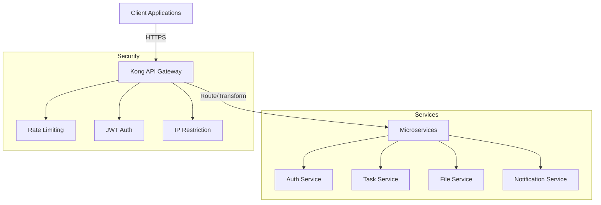

# Kong API Gateway Implementation Guide
Version: 3.4+  
Last Updated: 2024

## Table of Contents
1. [Overview](#overview)
2. [Architecture](#architecture)
3. [Security Implementation](#security-implementation)
4. [Monitoring and Operations](#monitoring-and-operations)
5. [Deployment Guide](#deployment-guide)
6. [Troubleshooting](#troubleshooting)

## Overview

The Task Management System utilizes Kong API Gateway v3.4+ as the primary API management layer, providing enterprise-grade routing, security, and monitoring capabilities for the microservices architecture.

### Key Features
- High-performance request routing and load balancing
- Enterprise-grade security with multi-layer protection
- Comprehensive monitoring and observability
- Rate limiting and DDoS protection
- Service discovery and health checks

### Component Architecture


## Security Implementation

### Authentication and Authorization
- JWT-based authentication with token validation
- Role-based access control (RBAC)
- IP whitelisting for internal services
- Bot detection and prevention

### Rate Limiting Configuration
```yaml
rate_limiting:
  minute: 1000
  policy: local
  fault_tolerant: true
  hide_client_headers: false
  redis_timeout: 2000
```

### Security Headers
```yaml
headers:
  - X-Frame-Options: DENY
  - X-Content-Type-Options: nosniff
  - Strict-Transport-Security: max-age=31536000; includeSubDomains
  - Content-Security-Policy: default-src 'self'; frame-ancestors 'none'
```

## Monitoring and Operations

### Health Check Implementation
- Active health checks every 5 seconds
- Passive health monitoring
- Circuit breaker pattern for service protection
- Automated failover support

### Metrics Collection
```yaml
prometheus_metrics:
  status_codes: true
  latency: true
  bandwidth: true
  database_metrics: true
```

### Logging Configuration
- Correlation ID tracking
- Structured JSON logging
- Audit logging for security events
- Performance metric logging

## Deployment Guide

### Prerequisites
- Docker 24.0+
- Kubernetes 1.27+
- Redis 7.0+ (for rate limiting)
- PostgreSQL 14+ (for Kong Admin API)

### Installation Steps
1. Deploy Kong configuration:
```bash
kubectl apply -f kong.yml
```

2. Initialize Kong:
```bash
./scripts/init-kong.sh
```

3. Configure routes:
```bash
./scripts/setup-routes.sh
```

### Service Configuration Matrix

| Service | Base Path | Rate Limit | Authentication |
|---------|-----------|------------|----------------|
| Auth | /api/v1/auth | 1000/min | IP Restriction |
| Tasks | /api/v1/tasks | 1000/min | JWT |
| Files | /api/v1/files | 1000/min | JWT |
| Notifications | /api/v1/notifications | 1000/min | JWT |

## Troubleshooting

### Common Issues and Solutions

#### Rate Limiting Issues
```bash
# Check rate limit configuration
curl -i -X GET http://localhost:8001/services/task-service/plugins

# Reset rate limit counters
redis-cli KEYS "kong_rate_limiting:*" | xargs redis-cli DEL
```

#### Authentication Failures
```bash
# Verify JWT configuration
curl -i -X GET http://localhost:8001/services/auth-service/plugins

# Check JWT token validity
curl -i -X GET http://localhost:8001/consumers/{consumer}/jwt
```

### Health Check Status
```bash
# Get service health status
curl -i -X GET http://localhost:8001/health

# Check specific service status
curl -i -X GET http://localhost:8001/services/{service_name}/health
```

## Performance Characteristics

### Baseline Metrics
- Request Latency: < 100ms (95th percentile)
- Throughput: 10,000+ requests/second
- Memory Usage: < 512MB per node
- CPU Usage: < 2 cores per node

### Scaling Guidelines
- Horizontal scaling with multiple Kong nodes
- Redis cluster for rate limiting synchronization
- Load balancer configuration for high availability

## Support and Maintenance

### Backup Procedures
1. Export Kong configuration:
```bash
kong config db_export > kong_backup_$(date +%Y%m%d).yml
```

2. Backup certificates and keys:
```bash
tar -czf kong_certs_$(date +%Y%m%d).tar.gz /etc/kong/certs/
```

### Update Procedures
1. Rolling updates with zero downtime
2. Configuration validation before deployment
3. Automated rollback capability
4. Health check verification post-update

## References

- [Kong Official Documentation](https://docs.konghq.com/gateway/3.4.x/)
- [Security Best Practices](https://docs.konghq.com/gateway/3.4.x/security/)
- [Rate Limiting Plugin](https://docs.konghq.com/hub/kong-inc/rate-limiting/)
- [Monitoring Guide](https://docs.konghq.com/gateway/3.4.x/monitoring/)